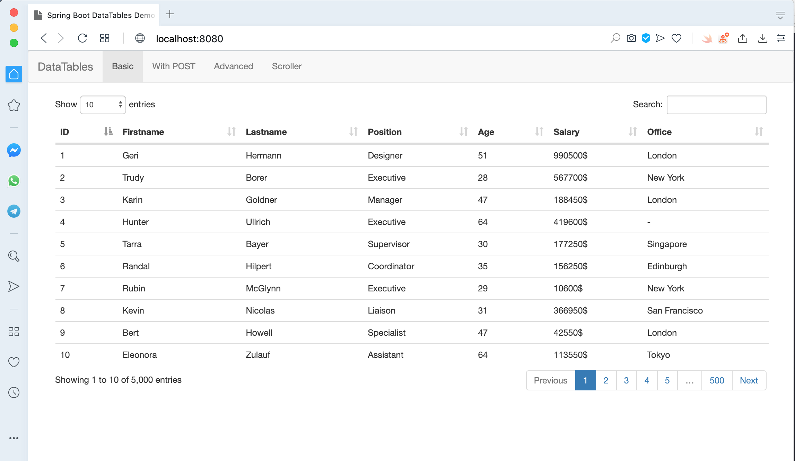
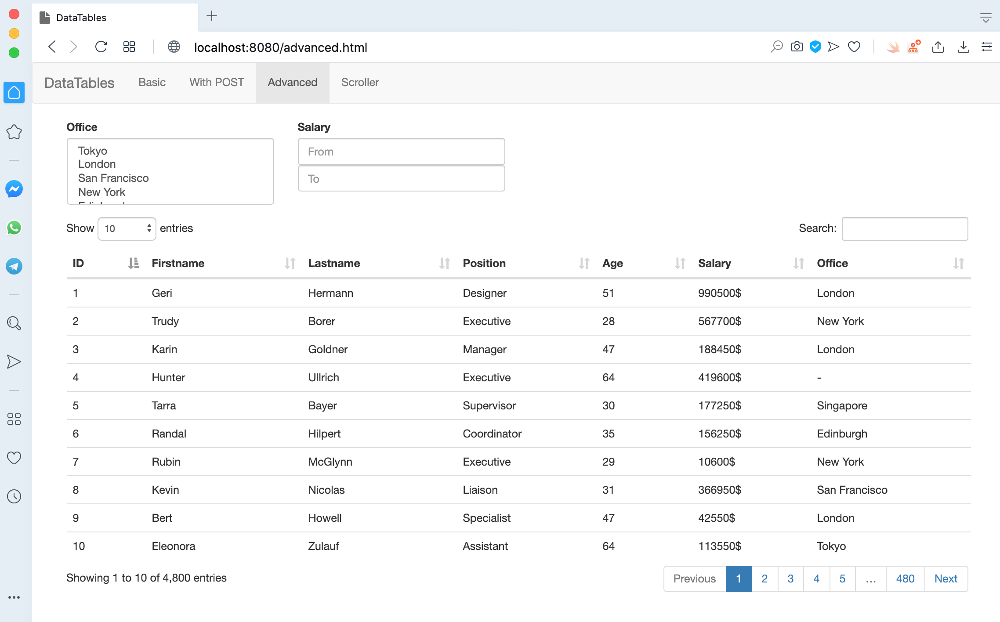
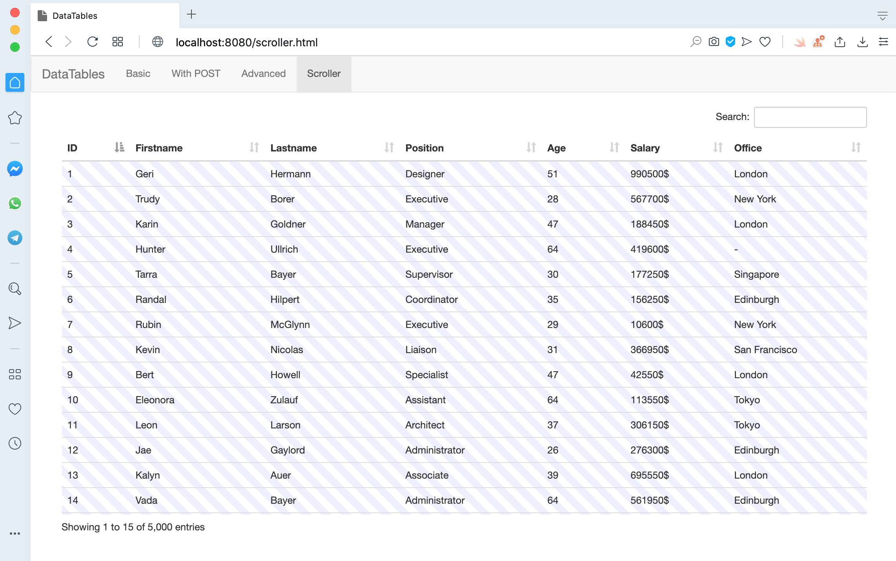

# springboot-datatable-demo
## Things to do list:
1. Clone this repository: `git clone https://github.com/hendisantika/springboot-datatable-demo.git`.
2. Go inside the folder: `cd springboot-datatable-demo`.
3. Run the application: `mvn clean spring-boot:run`.
4. Open your favorite browser: http://localhost:8080

## Screen shot

Basic Page

Advanced Page

Scroller Page

